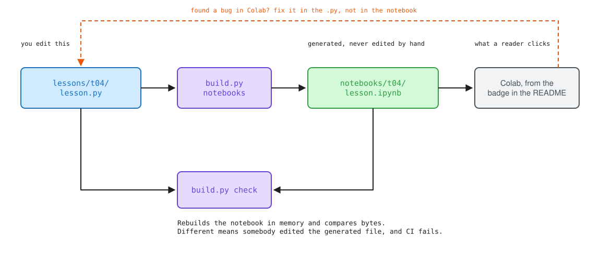

# The lesson format

A lesson is one Python file. `build.py` turns it into the notebook that Colab opens. This page is the whole format, and there is not much of it on purpose.



## Why the source is not the notebook

Notebook JSON is unreviewable. A one word change to a sentence shows up as a diff of the whole cell, cell ids move around, execution counts change, and outputs get committed by accident. After a few months of that, nobody reads notebook diffs, and once nobody reads them the material stops being reviewed at all.

So you edit `lessons/<id>/lesson.py` and the `.ipynb` is build output. It is still committed, because Colab can only open a file that exists at a URL, but it is marked as generated and `build.py check` fails if it does not match its source.

There is a second reason, and it matters more than the first. Cells are emitted in source order with no execution counts and no outputs, which means a notebook in this repository cannot carry hidden state. That is worth something in any project and it is worth a lot in one where several lessons are about hidden state.

## The file

```python
# ---
# id: t04_the_pass_tape
# title: The pass tape
# question: I typed -O2 and my function changed, which pass changed it?
# part: I
# env: E0
# minutes: 35
# needs: [t01_your_first_ll, t03_driving_opt]
# blueprints: [BP-AN-PM]
# ---

# %% [markdown]
# # The pass tape
#
# Two hundred passes run when you type `-O2`. Almost all of them do nothing to
# your function, a handful do everything, and the ones that matter are not the
# ones with the famous names.

# %%
mod = irx.compile_c(SOURCE)
tape = irx.tape(mod, "default<O2>")
tape

# %% env=E1
# Needs a full build tree, so it runs locally and replays from a recording in Colab.
irx.build.rebuild(["opt"])

# %% include=grade.py id=grader

# %% [markdown]
# ## What just happened
```

## The header

Between the two `# ---` lines, one key per line. Unknown keys are an error rather than something that gets quietly ignored, because a header key that does nothing is worse than one that complains.

| Key | Required | What it is |
|---|---|---|
| `id` | yes | Must match the directory name |
| `title` | yes | Sentence case, no trailing full stop |
| `question` | yes | The sentence somebody would type into a search box |
| `part` | yes | Roman numeral, or `0` for Part 0 |
| `env` | yes | `E0`, `E1` or `E2`, meaning where the lesson can run |
| `minutes` | yes | Honest estimate for a reader at the target level |
| `needs` | no | Lesson ids a reader should have done first |
| `blueprints` | no | Blueprints this lesson leans on |
| `bootstrap` | no | Set to `none` to skip the toolchain cell |

## Cells

`# %%` starts a code cell. `# %% [markdown]` starts a markdown cell, and every line of it is a comment, so the file stays valid Python and your editor keeps working.

Options go after the marker as `key=value`:

| Option | What it does |
|---|---|
| `env=E1` | This one cell needs a full build tree. It gets tagged so CI does not try to execute it, and it plays back from a recording for readers on Colab. |
| `tags=a,b` | Raw notebook cell tags, for anything the format does not cover yet. |
| `id=name` | A stable name for the cell, so a grader or another lesson can refer to it. |
| `include=grade.py` | The cell body comes from that file, which has to sit next to `lesson.py`. The cell itself must be empty. |

The first cell has to be markdown. A lesson opens with a hook, not with an import.

`question` is required because a lesson that cannot be phrased as a question somebody already has is a lesson looking for a reader. It is also what the site indexes, so it should read like a person typing, not like a chapter heading.

`include` exists for graders. A grader has to ship inside the notebook, because Colab has no checkout of this repository to import from, and it also has to be an ordinary Python file so it can be linted and unit tested like anything else. Writing it twice would mean the tested copy and the shipped copy drift apart, and the one that drifts is the one nobody runs. The include is resolved when the lesson is loaded, so editing `grade.py` makes the notebook stale and `build.py check` says so.

## What build.py adds for you

Two cells, prepended, so that 102 lessons do not each carry their own copy of a preamble that will be wrong in forty of them within a year.

The Colab badge, pointing at this lesson's notebook on `main`. And the bootstrap cell, which installs `irx` and puts the pinned LLVM on the machine. Set `bootstrap: none` in the header if a lesson genuinely does not need a compiler.

## Commands

```
python3 build.py new x03_your_first_fold   scaffold a lesson
python3 build.py list                      what exists, with env and length
python3 build.py notebooks                 regenerate, or --only x03_your_first_fold
python3 build.py check                     what CI runs
python3 build.py run --only x03            execute from a cold kernel
python3 build.py diagrams                  regenerate docs/diagrams
```

`check` rebuilds every notebook in memory and compares it byte for byte with what is committed. If they differ, somebody edited a generated file, and the fix is to move the change into the `.py` and rebuild.

It also prints a note for any `needs` entry that names a lesson nobody has written yet. That is a note and not a failure on purpose. The lessons get written out of order, so an early pilot names three prerequisites that do not exist, and turning that into a red build would push somebody into deleting the header line to get green, which throws away the one piece of information the line was carrying.

## Byte stability

`notebooks` has to produce the same bytes every time or the check above is worthless. Three things make that true.

Cell ids come from a hash of the cell's position and its content rather than from a random number, which is what nbformat would normally use. Position is in the hash so two identical cells do not collide, and content is in the hash so a cell keeps its id when something above it changes.

The JSON is written with one canonical serialisation, sorted keys and an indent of one, which is what Jupyter itself writes.

Nothing in the output depends on the clock, the machine, or the order the filesystem hands back directory entries.

## Prototyping in Colab

Open the notebook, break things, work out what the cell should say. Then put the fix in the `.py` and rebuild. If you forget, the next `build.py check` tells you, and a pre commit hook rebuilds anyway.

This is the one workflow wrinkle the format introduces, and it is worth it. The alternative is reviewable prose in an unreviewable container.
