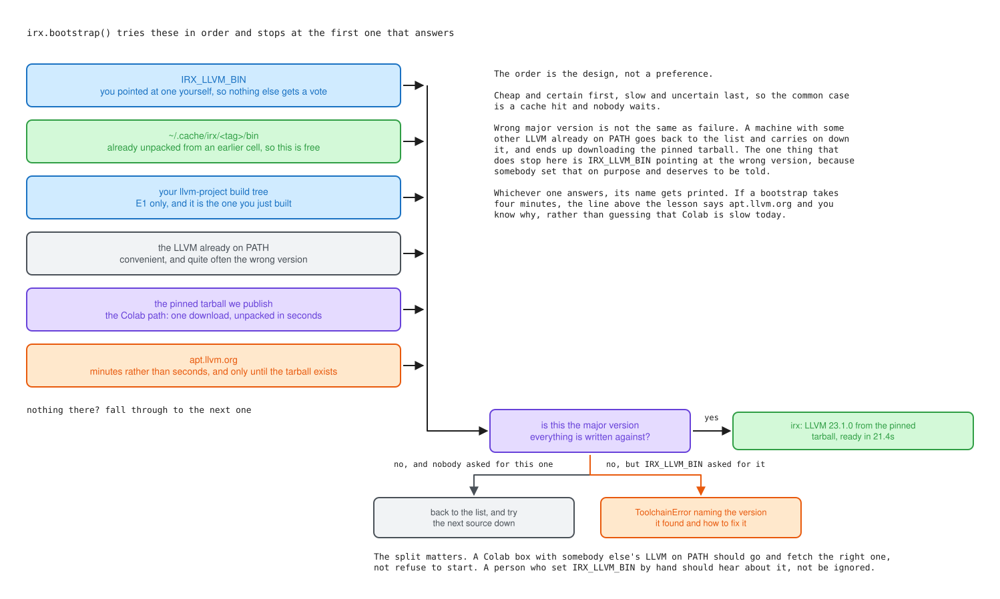
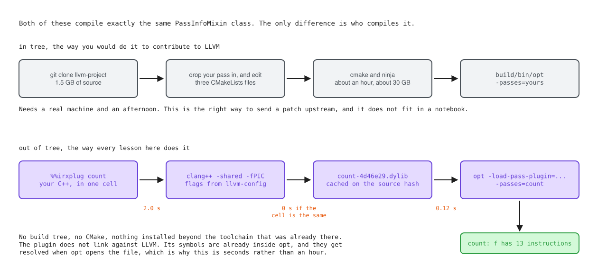
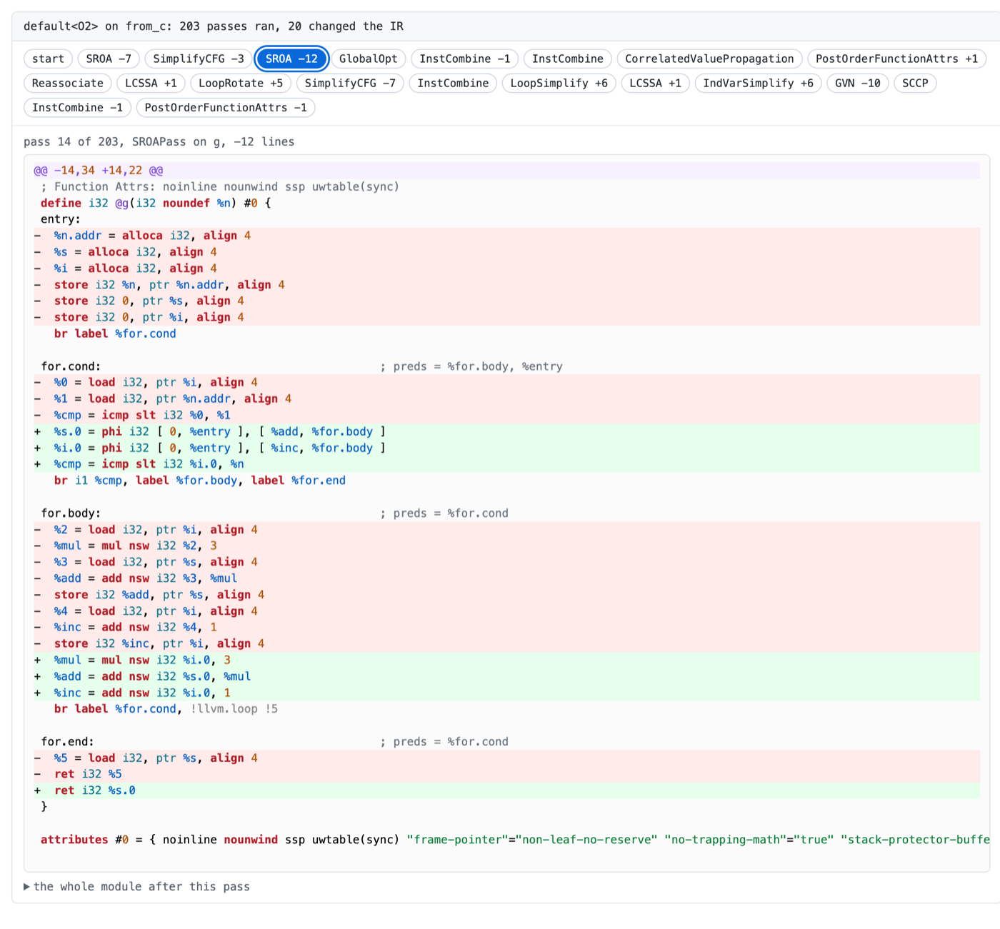

# irx

The small amount of Python that sits between a lesson and a real LLVM.

Every lesson in this repository starts the same way. A cell installs this package, calls `irx.bootstrap()`, and prints one line saying which LLVM it got and where from. After that the lesson is free to compile things, run passes and look at the output, and none of it has to care whether it is running on Colab, on your laptop, or in a browser tab.

## What it does and does not do

`irx` never does LLVM's job. It does not parse IR, it does not model a pass, and it does not reimplement anything you could ask a binary for. It finds a pinned toolchain, runs it, and renders what came back in a form that reads well in a notebook.

That restraint is the whole point. When upstream changes a pass, the lesson output changes with it and the material stays true. A helper that reimplemented `instcombine` in Python would be a helper that is confidently wrong two releases from now, and nobody would notice until a reader learned something false.

So the list of things in here is short:

- find a pinned LLVM, or fetch one, and refuse the wrong version
- run a tool and turn a failure into a message a person can act on
- hold IR as text, and show a before and after so the change is the thing you notice

## The pin

Everything is written against one tag, which lives in [`irx/pin.json`](irx/pin.json) and is a copy of [`docs/pin.json`](../docs/pin.json) at the top of the repository. A test keeps the two in sync.

Names, defaults and pass behaviour differ between LLVM major versions. A lesson run against the wrong one is not broken in any way you would see, it quietly teaches you something that is not true, so `irx` would rather stop than let that happen.

## Getting a toolchain

`irx.bootstrap()` tries a list of sources in order and stops at the first one that answers with the right major version.



The interesting rule is what happens on a version mismatch. If the LLVM already on your PATH is the wrong one, that is not treated as a failure, it goes back to the list and keeps going down, and usually ends up downloading the pinned tarball. The one case that does stop is `IRX_LLVM_BIN` pointing at the wrong version, because somebody set that by hand and being ignored would be worse than being told.

Two environment variables are worth knowing:

| Variable | What it does |
| --- | --- |
| `IRX_LLVM_BIN` | Use this `bin` directory and nothing else. Wins over every other source. |
| `IRX_ALLOW_VERSION_SKEW` | Set to `1` to run against a different major version anyway. Expect some lessons to disagree with what you see. |
| `IRX_CACHE` | Where the fetched tarball is unpacked. Defaults to `~/.cache/irx`. |

## Using it

```python
import irx
irx.bootstrap()
```

```
irx: LLVM 23.1.0 from the pinned tarball, ready in 21.4s
irx: E0, Colab. Real LLVM binaries, no build tree, so no in tree modification.
```

A module comes from C, from C++, from a file, or from IR you typed yourself:

```python
m = irx.Module.from_c("int f(int x) { int y = x + x; return y * 2; }")
m          # renders as coloured IR in the cell
```

Running a pipeline gives you a new module and leaves the original alone, so both can be on screen at once:

```python
after = m.opt("mem2reg,instcombine")
m.diff(after)
```

```diff
@@ -6,15 +6,7 @@
 define i32 @f(i32 noundef %x) #0 {
 entry:
-  %x.addr = alloca i32, align 4
-  %y = alloca i32, align 4
-  store i32 %x, ptr %x.addr, align 4
-  %0 = load i32, ptr %x.addr, align 4
-  %1 = load i32, ptr %x.addr, align 4
-  %add = add nsw i32 %0, %1
-  store i32 %add, ptr %y, align 4
-  %2 = load i32, ptr %y, align 4
-  %mul = mul nsw i32 %2, 2
+  %mul = shl nsw i32 %x, 2
   ret i32 %mul
 }
```

That diff is nine instructions turning into one, and it is the reason `diff` exists at all. An after picture on its own does not show you that.

## Writing a pass in a cell

This is the part that decides how much of the project is possible. Building LLVM from source is an hour and 30 GB, so if writing a pass meant doing that, then every lesson about writing passes would need a machine that nobody reading in a browser tab has. An out of tree plugin needs neither. It is one C++ file compiled against installed headers, and `opt` loads it at run time.



The class you write is the same either way. `PassInfoMixin`, a `run` method, the same analysis managers. What changes is who compiles it and how long you wait.

```
%%irxplug count
#include "llvm/IR/PassManager.h"
#include "llvm/Passes/PassBuilder.h"
#include "llvm/Plugins/PassPlugin.h"
#include "llvm/Support/raw_ostream.h"

using namespace llvm;

namespace {
struct CountInstructions : PassInfoMixin<CountInstructions> {
  PreservedAnalyses run(Function &F, FunctionAnalysisManager &) {
    unsigned n = 0;
    for (BasicBlock &BB : F) n += BB.size();
    errs() << "count: " << F.getName() << " has " << n << " instructions\n";
    return PreservedAnalyses::all();
  }
};
} // namespace

extern "C" LLVM_ATTRIBUTE_WEAK ::llvm::PassPluginLibraryInfo llvmGetPassPluginInfo() {
  return {LLVM_PLUGIN_API_VERSION, "count", LLVM_VERSION_STRING, [](PassBuilder &PB) {
            PB.registerPipelineParsingCallback(
                [](StringRef Name, FunctionPassManager &FPM,
                   ArrayRef<PassBuilder::PipelineElement>) {
                  if (Name == "count") {
                    FPM.addPass(CountInstructions());
                    return true;
                  }
                  return false;
                });
          }};
}
```

```
irx: plugin 'count' compiled in 1.3s
irx: `opt` will load it as count-4d46e29640d6.dylib, and `count` is now a pass name
```

After that `count` is a pass name like any other, and nothing has to be told where the file went:

```python
m = irx.Module.from_c("int f(int x) { int y = x + x; return y; }")
m.opt("count")
m.opt("mem2reg,count")
```

```
count: f has 8 instructions
count: f has 2 instructions
```

Same pass, same function, run either side of `mem2reg`, and that is a lesson.

A few details that took some finding:

**`PassPlugin.h` moved.** It is `llvm/Plugins/PassPlugin.h` in this release, not `llvm/Passes/PassPlugin.h`. Nearly every pass plugin tutorial online predates the move, so it is the first error most people hit, and `irx` recognises it and says so.

**The compile flags come from `llvm-config --cxxflags`, not from us.** A plugin has to agree with the LLVM that loads it about RTTI, exceptions and the C++ standard. Getting one of those wrong gives you an undefined symbol at load time, or a crash. `llvm-config` knows how its own LLVM was built, so it gets asked rather than guessed at.

**Nothing links against LLVM.** The symbols a plugin needs are already inside `opt` and get resolved when it opens the file. ELF does that by default. Mach-O needs `-Wl,-undefined,dynamic_lookup`, which is added for you on macOS and left off everywhere else.

**Rebuilds are cached on content.** The key covers the source, the LLVM version and the flags, so editing the cell recompiles and rerunning an unchanged cell costs nothing. In a lesson where somebody runs the same cell thirty times, only the edits are paid for.

## Watching a whole pipeline

A before and after tells you what `-O2` did. It does not tell you that `-O2` ran two hundred passes to do it and that twenty of them were responsible. That ratio is the most useful thing to know about the middle end and it is invisible until you look, so `tape` keeps every step of a run instead of only the answer.

```python
m = irx.Module.from_c(source)
m.tape("default<O2>")
```



Click a pass and you get the diff it caused. The chips carry the line count change, so you can see at a glance that `SROA` did the heavy lifting on `g` and that `IndVarSimplify` made the function longer rather than shorter. Arrow keys move along the strip.

It all comes from one `opt` run:

```
opt -passes=default<O2> --print-changed --print-module-scope -S -
```

`--print-changed` dumps the module after a pass that changed something and prints a one line note for every pass that did not, which is where both halves of "203 passes ran, 20 changed the IR" come from. `--print-module-scope` makes every dump the whole module rather than only the function a function pass ran on, so consecutive frames are comparable and the diff between them means something. Nothing here parses IR. It splits `opt`'s output on `opt`'s own headers and everything after that is `difflib` on text.

Outside a notebook you get the same information as a table:

```
default<O2> on from_c: 203 passes ran, 20 changed the IR

     9  SROA                       f                       -7 lines
    13  SimplifyCFG                g                       -3 lines
    14  SROA                       g                       -12 lines
    19  GlobalOpt                  [module]                same length
    ...
```

**There is no JavaScript in the widget.** Colab renders cell output inside a sandbox, JupyterLite has no kernel to call back into, and the published site is static HTML that nobody will ever rerun. A hidden radio button per frame and a sibling selector is the one mechanism all of those agree on, and it keeps working in a saved notebook years later. If a renderer strips the stylesheet, which GitHub does, what is left is the first frame and a readable list of pass names with their line counts rather than twenty modules stacked on top of each other.

**A pass that counts is not the same as a pass that ran.** `SROA` on two functions is two steps, because that is two runs over two pieces of code. Pass managers, adaptors and the verifier are not counted at all, because they are plumbing and counting them would inflate the one number the whole thing exists to report.

**A printing pass shares a stream with the dumps.** `opt` writes the frames to stderr and your `errs()` goes to the same place, so a teaching pass ends up stuck to the bottom of the frame before it. Rather than guess where the IR stops, `irx` asks `llvm-as`, which reports the line it stopped understanding on, and cuts there. This only happens when you have a plugin loaded, so a stock pipeline pays nothing for it.

**One pass changes the module and leaves no picture of it.** When a loop pass deletes its own loop, `opt` has nothing left to print, so instead of a dump it writes a single line:

```
*** IR Pass LoopDeletionPass invalidated ***
```

That pass is on the tape, it counts as a change, and its panel says what happened rather than showing a diff. So a tape can have more changes than it has frames, and `tape.changed` and `tape.frames` are not the same length. `tape.shown` is the passes that both changed the module and left a dump, which is the list the frames line up with.

**An `*** IR ...` line that `irx` does not recognise is an error, not a shrug.** An unrecognised banner does not announce itself, it gets swallowed into the previous frame, and the only symptom is that a few line counts are quietly wrong. The line above is exactly that bug: it went unread for a while and `LoopDeletion` was missing from every tape as a result. `tape(..., strict=False)` turns the check off if you would rather have a slightly wrong tape than none.

## Guessing before looking

A lesson that shows you the answer teaches less than a lesson that makes you commit to one first. `irx.gate` is a question, two to four options, and an explanation of every option including the wrong ones.

```python
irx.gate(
    "Three passes in default<O2> can delete a repeated load. Which one deletes this one?",
    {
        "InstCombine": "It rewrites instruction patterns and runs first, at pass 16.",
        "EarlyCSE": "It runs at pass 10 and its whole job is spotting the second copy of something.",
        "GVN": "It can do this, and by the time it runs at pass 45 there is nothing left to find.",
    },
    answer="EarlyCSE",
)
```

The wrong options get a real explanation too. A reader who picked the second one and is told only that they were wrong has learned the least of anybody in the room.

Same rules as the tape: no JavaScript, the reveal is a `<details>`, the highlight on what you picked is a radio button and a sibling selector, and the answer is named in a sentence as well as tinted so a renderer that drops the stylesheet still tells you which one it was. Printing a gate in a terminal shows the question, the options, the answer and every explanation, because there is nowhere in plain text to hide something behind a click and pretending otherwise would make it a puzzle instead of a lesson.

## When a tool fails

The default subprocess failure is `CalledProcessError: returned non-zero exit status 1`, which tells a reader who has never run `opt` before absolutely nothing. `irx` raises `ToolError` instead, with the command, the real stderr, and where possible a sentence about what to do:

```
opt exited 1

  $ /usr/lib/llvm-23/bin/opt -passes=instcombin -S -

  opt: unknown pass name 'instcombin'

That pass name is not in this build. Pass names are case sensitive and
several changed spelling between releases. `irx.passes()` lists what
this exact binary accepts.
```

A handful of failures get a hint like that, and the list is not a list of everything that can go wrong. It is the ones people actually hit: a pass name that does not exist, a parse error in hand written IR, a pass plugin path that points at nothing, the `PassPlugin.h` header that moved, an undefined symbol at load time, and an LLVM install that has the tools but not the headers.

## Notes on some choices

**No runtime dependencies.** This gets pip installed inside a Colab cell before anything else happens, so every dependency is time a reader spends watching a progress bar, and every version pin is a chance to argue with whatever Colab already has.

**`-fno-discard-value-names` and `-Xclang -disable-O0-optnone` are passed for you.** The first is the difference between reading `%counter` and reading `%7`. The second matters more: without it clang marks every function `optnone` at `-O0`, so every pass you run does nothing at all, and working out why is a bad first hour.

**The `; ModuleID` line is rewritten.** It holds the name of the file the tool read, so clang writes `-` and `opt` writes `<stdin>`. Left alone it would be the first hunk of every before and after in the whole course, and it means nothing.

**Only known tools can be run.** `irx.run` takes a bare name like `opt` and resolves it against the pinned toolchain, and a name that is not on the allowed list is refused. The stripped tarball does not carry every LLVM binary, and finding that out from a clear error beats finding it out from a subtly different answer.

## Tests

```
cd toolkit
python3 -m unittest discover -s tests -t .
```

Two kinds of test live there. The ones that do not need a compiler run anywhere, including on a CI runner with no LLVM on it. The ones that do run the real binaries and skip with a reason when there is no pinned toolchain, because a test that quietly passes against the wrong LLVM is worse than one that says it did not run.

## Licence

Apache-2.0 WITH LLVM-exception, matching upstream.
